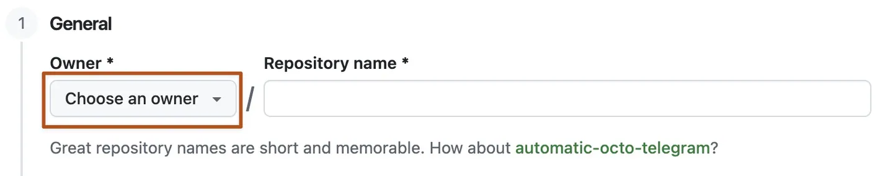

> [!IMPORTANT]
> **Already reading this in an Exercise issue or your own private copy? The copy is already created.** Do not create another repository. Skip only the copy-creation substeps below; continue with cloning/opening **this existing copy**, account checks and the first edit. If Git or desktop VS Code is not installed, use [the installation guide](../../docs/toolchain.md) before cloning.

## Laboratory 03 - Step 1/4

### Start at the independent security-module boundary

| Before you begin | This step |
| --- | --- |
| Goal | Set up this copy, create an NSG from caller inputs, and expose its resource-backed ID. |
| Time | 25–35 minutes including first-time setup. |
| Files | Edit [main.tf](../../main.tf) and [outputs.tf](../../outputs.tf); read [variables.tf](../../variables.tf). |
| Starting branch | Your private copy's actual default branch, normally `dev`; create `lab/security`. |

Beginner guides: [Start here](../../docs/start-here.md) · [Git workflow](../../docs/git-workflow.md) · [Copilot guide](../../docs/copilot-guide.md) · [Toolchain](../../docs/toolchain.md) · [Troubleshooting](../../docs/troubleshooting.md).

> [!NOTE]
> No Lab 02 copy or deployed subnet is needed. This repository root **is** the standalone subnet-security module.
> It receives synthetic subnet IDs in its supplied mocks; it must not create or discover the caller's infrastructure.
> Use Cmd+P, Cmd+S, Cmd+Shift+P, and the Source Control icon on macOS; Windows/Linux shortcuts follow below.

### 1. Create your own private Laboratory 03 copy

1. In GitHub's browser profile menu, confirm your invited personal account; an organization owner is not a personal login.
2. Open [alvinea28/ws2-subnet-security-laboratory-03](https://github.com/alvinea28/ws2-subnet-security-laboratory-03).
3. Select **COPY EXERCISE**, or **Use this template** → **Create a new repository**.
4. Choose the authorized **Owner**, enter a unique name ending in `laboratory-03`, select **Private**, and leave **Include all branches** unchecked.
5. Select **Create repository** and confirm your new owner/name and **Private** badge; do not work in the public template.
6. Allow startup automation to finish, refresh, and open the **Exercise** link or the existing Exercise under **Issues**.


*REFERENCE — GitHub publisher screenshot, CC BY 4.0. Example names are not your private copy or account; [attribution](../../docs/images/NOTICE.md).*

### 2. Clone and open only this repository

1. In your private copy select **Code** → **HTTPS** and copy its credential-free clone URL.
2. In desktop VS Code press **Ctrl+Shift+P** → **Git: Clone**, paste **your own copy URL**, and press **Enter**.
3. If asked, select **Allow** for the sign-in you initiated; verify the correct personal GitHub account on the browser authorization page.
4. Authorize the recognized VS Code request and select **Open Visual Studio Code**; complete a separate trusted Git Credential Manager browser flow if it appears.
5. Select a local **parent folder** → **Select as Repository Destination** → **Open** after cloning finishes.
6. Trust only this known workshop clone, not the entire parent; confirm **Explorer** opens the clone itself.
7. If it shows several repositories, use **File** → **Open Folder...** for this clone. Do not use the parent workspace, an extracted ZIP, or `github.dev`.


*REFERENCE — Microsoft publisher screenshot, CC BY 3.0 US. Choose your own copy, not its Microsoft example repositories; [attribution](../../docs/images/NOTICE.md).*

### 3. Verify account selection, tools, and local authorship

1. Open VS Code **Accounts** and verify the intended GitHub personal account independently of the browser's session.
2. Use **Sign in with GitHub to use GitHub Copilot** if needed; confirm Copilot's selection in **Manage Extension Account Preferences...**.
3. Ask the instructor to confirm the expected Copilot seat/entitlement. Reading a private clone does not prove push permission or Copilot access.
4. Follow [repository-local authorship setup](../../docs/start-here.md#set-authorship-only-for-this-repository); never use a password as author metadata.
5. Select **Terminal** → **New Terminal**, check the clone root, and run one line at a time:

```powershell
node --version
terraform version
node scripts/doctor.mjs
```

Expect Node **24.16.0**, Terraform **1.16.1**, and supplied AzureRM **5.4.0** requirements/lock. Read every doctor `CHECK`.
The doctor does not install, authenticate, certify a Copilot seat, or authorize Azure. Report a missing doctor as an incomplete package.


*REFERENCE — Microsoft publisher screenshot, CC BY 3.0 US. An example prompt is not proof of your authentication; [attribution](../../docs/images/NOTICE.md).*

### 4. Create the branch and read all six inputs

1. Press **Ctrl+Shift+G** for **Source Control**; confirm this repository, a clean working tree, and the copy's actual default branch, normally `dev`.
2. Select **...** → **Pull** while clean to receive any AgentAlvine landing-page change.
3. Press **Ctrl+Shift+P** → **Git: Create Branch...**, enter `lab/security`, and press **Enter**; verify that exact status-bar branch.
4. Select the existing branch if it already exists rather than inventing another spelling.
5. Press **Ctrl+P** → [variables.tf](../../variables.tf); preserve the complete types and validation for all six inputs below.

| Input | Ownership/validation boundary |
| --- | --- |
| `name`, `resource_group_name`, `location` | Caller-selected NSG name, existing group, and region; no discovery is needed. |
| `subnet_ids` | Nonempty map of stable names to full Azure-shaped subnet IDs containing a subscription UUID. |
| `tags` | Nonblank ownership values, including `owner`, `environment`, `cost_center`, and `workshop`. |
| `rules` | Optional custom-rule map, empty by default; inbound Allow sources must be explicit IPv4 RFC1918 CIDRs. |

Leave these declarations, the version file, and the provider lock unchanged. The mock IDs are inert fixtures, not subscription credentials.

### 5. Implement the NSG and its first output

1. Press **Ctrl+P** → [main.tf](../../main.tf); replace the starter comments with this resource, then press **Ctrl+S**:

```hcl
resource "azurerm_network_security_group" "this" {
  name                = var.name
  resource_group_name = var.resource_group_name
  location            = var.location
  tags                = var.tags
}
```

2. Press **Ctrl+P** → [outputs.tf](../../outputs.tf); replace only the existing `nsg_id` block with the following and press **Ctrl+S**:

```hcl
output "nsg_id" {
  description = "Azure resource ID of the managed network security group."
  value       = azurerm_network_security_group.this.id
}
```

3. Keep the supplied `association_ids` placeholder for Step 2; do not return fake IDs to hide unfinished association work.
4. The root must contain no VNet, subnet, VM, resource group, data lookup, configured provider, or backend.
5. Keep tags on the NSG only; rules and associations do not support them.

> [!WARNING]
> No Azure login, backend initialization, state access, or real plan/apply is permitted. Mocks need no live infrastructure.
> Empty custom rules preserve Azure's built-in rules, including internal VirtualNetwork access; this is not zero trust or a complete egress policy.

### 6. Review, stage, commit, publish, and inspect the current run

1. Press **Ctrl+Shift+G**, open both diffs under **Changes**, and verify only the NSG and its output were implemented.
2. Select each file's **+** (**Stage Changes**), inspect **Staged Changes**, enter `lab: build the standalone security NSG`, and select **Commit**.
3. Select **Publish Branch** for the first push to your copy's existing `origin`; use **...** → **Push** after later commits.
4. Refresh **your own GitHub copy**, select `lab/security` in **Code**, and inspect its newest commit and both changed files.
5. Select **Actions** → **Lab checks** → that newest-commit run → **Test learner module** → the learner-check command log.
6. Read the first actual diagnostic. Full CI can remain red because rules, associations, example, and tests are still unfinished.
7. Refresh the Exercise **body** after **AgentAlvine** finishes; inspect **AgentAlvine** → **guide** logs if the task does not advance.


*REFERENCE — Microsoft publisher screenshot, CC BY 3.0 US. Its example `main` is not your `lab/security` branch; [attribution](../../docs/images/NOTICE.md).*

### Expected result and what AgentAlvine checks

- The pushed root contains `azurerm_network_security_group.this` wired to the four caller inputs and a resource-backed `nsg_id` output.
- It excludes resource-group/VNet creation and a configured root provider; final CI will check actual behavior after subsequent tasks.
- No earlier lab result, fabricated cloud resource, or human review event is needed for this step.

### Troubleshooting

| Symptom | Specific recovery |
| --- | --- |
| Setup or remote is wrong | Reopen the own-copy clone and use the linked setup guide; do not initialize nested Git or retarget an unfamiliar remote. |
| Gate cannot find the NSG or output | Check exact resource/output labels, **Ctrl+S**, staged diff, commit, branch, and push. |
| CI reports missing associations | Keep the diagnostic and continue to Step 2; do not delete the association tests. |
| Copilot asks for real subnet discovery | Reject that proposal: the caller supplies IDs and the test fixtures are already included. |

**Next action:** remain on `lab/security` and open [Step 2: map rules and associations](02.md).
