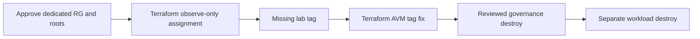

# Azure Policy: observe, fix and clean up

[First-time setup](start-here.md) · [Git help](git-workflow.md) · [Repository](../README.md)

**Goal:** use the supplied [governance companion](../governance/README.md) to observe,
correct and remove a tag-policy assignment in [Microsoft's DevSecOps IaC flow](https://learn.microsoft.com/en-us/azure/architecture/solution-ideas/articles/devsecops-infrastructure-as-code).
The workload uses Terraform AVM; Policy uses native AzureRM, not an invented AVM.
No Bicep or Sentinel.

> [!IMPORTANT]
> Additional procedure, **outside the original 33 graded activities**; historical
> scores are unchanged. No live authoring operations occurred. Configuration validation
> and **2 contract cases passed**, not live compliance tests. AgentAlvine progress and screenshots are not
> workshop completion or Azure authorization. Live state access, changes and cleanup
> require instructor approval and the existing independent human review gates.

## 1. Confirm the disposable boundary

Complete [setup](start-here.md) and [Azure setup](azure-setup.md) with your own
assigned account, tenant, subscription and **existing dedicated lab RG**. An
instructor-provided or separately approved disposable Terraform AVM VNet/NSG is
sufficient; no earlier lab is required. The workload keeps its own root/state.

The instructor must confirm your actual definition/assignment read, assignment
write/delete and compliance-read permissions, workload permissions/inventory,
costs, cleanup owners and protected writers. Reading an RG or holding Contributor
alone does not grant policy-assignment rights. Missing access means stop, not
assistant role/identity changes.

**Scope is exactly the dedicated RG:** this configuration creates an RG policy
assignment, not an individual-resource assignment. It affects eligible resources
throughout that group. Never substitute a shared RG, subscription or management
group, or bypass the scope acknowledgement to make a plan pass.

## 2. Review the real Terraform configuration

| File | What it actually supplies |
| --- | --- |
| [main.tf](../governance/main.tf) | Terraform **1.16.1**, AzureRM **4.81.0**; `azurerm_policy_definition.require_tag` looks up **Require a tag on resources**; `azurerm_resource_group_policy_assignment.lesson` owns the assignment with fixed `tagName = ws2-policy-demo` |
| [variables.tf](../governance/variables.tf) | Your scope/name inputs, `dedicated_scope_confirmed = false` precondition and initial `enforce = false` |
| [tests/scope.tftest.hcl](../governance/tests/scope.tftest.hcl) | Two authoring-only mock plans: observe-only RG assignment and rejection of unconfirmed scope; not live compliance tests |

Use the [profile README](../governance/README.md) for credential-free validation
commands and lockfile prerequisites. Keep this profile's dependencies/state
separate from the AzureRM **5.4.0** exercise. It has no configured live backend
and is **not connected to the baseline Lab 07 workflow**.

## 3. Create through the approved Terraform root

1. In the instructor-designated **approved Terraform root/state**, map your Azure
   guide values to `tenant_id`, `subscription_id` and `resource_group_name` through
   the approved private input method. Choose your own unique `ws2-policy-` name
   with a 2–26-character lowercase alphanumeric/hyphen suffix, starting alphanumeric.
2. Set `dedicated_scope_confirmed = true` **only after** the actual dedicated-RG
   inventory and permission checks. This acknowledgement grants no rights. Keep
   `enforce = false`; preserve the precondition, built-in reference and fixed tag.
3. Version nonsecret policy intent in Git. The approved writer produces a fresh
   saved plan against its approved backend/state; an independent human reviews the
   encrypted plan before protected apply. Expect **one assignment**, exact RG and
   observe-only enforcement, with no RG, workload, identity or exemption creation.
4. After approved apply, use **Portal → Policy → Assignments** only to inspect the
   exact assignment. Read the built-in definition's ID/version/rule and assignment
   scope, parameters, enforcement, exclusions/exemptions and timestamp privately.
   Any mismatch means stop. **Do not create, edit or delete this assignment in Portal.**

**Why:** the built-in has fixed `Deny` and checks tag **presence**, not its value
or RG tags. `enforce = false` maps to **Disabled / DoNotEnforce**: evaluation
without blocking, not a change to `Audit`. Enforced `Deny` rejects noncompliant
creates/updates; it does not delete existing resources or repair them automatically.

## 4. Observe a mismatch, then fix the source

1. In your workload clone, create a task branch using [Git help](git-workflow.md).
   Omit **only** `ws2-policy-demo` from the approved disposable resource's AVM
   tags; preserve organizational tags. Already absent? Leave it absent. Any
   workload change needs its own approved root/state, reviewed plan and writer.
2. Open **Policy → Compliance → your assignment → Resource compliance**; select
   your VNet/NSG and read its reason/timestamp.
   **Expected:** missing-tag noncompliance, without denial in `DoNotEnforce`.
3. Add/restore the tag with nonsecret value `training` in Git/Terraform AVM,
   inspect current CI and use approved delivery. Revisit the **same assignment
   and resource**. **Expected:** compliant after evaluation, not immediately.

Evaluation is asynchronous; assignment/update results can take minutes and routine
reevaluation runs about every 24 hours. **Refresh** reloads results, not a scan.
Stale/missing results remain pending: inspect scope, tag spelling, exclusions and
timestamp. Another policy's denial is not proof of this experiment.

**Optional denial experiment — separate live approval:** change `enforce` to `true`
through Git/Terraform and a fresh independently reviewed saved plan in the same
governance root/state. Submit the approved missing-tag workload change through its
own protected writer; expect this policy's rejection. Restore compliant workload
source and return `enforce` to `false` through reviewed Terraform delivery. Never
use Portal enforcement edits, exemptions or other-control bypasses.

Self-inspect and merge educational PRs only where repository rules permit. GitHub
cannot approve your own PR; required nonauthor reviews and independent **live**
approvals remain. Git changes and issue progress do not authorize apply.

## 5. Clean up through each owning root

First request a **full saved destroy plan for the governance root**, independently
review it and apply that exact plan through its approved writer/state. It removes
the owned assignment only; preserve the built-in and all shared policies. Verify
assignment absence in protected state and read-only Azure inventory. No Portal delete.

Then perform the disposable workload's **separate full Terraform destroy**, using
its own original root/state and a fresh independently reviewed saved plan. Follow the
[cleanup boundary](azure-setup.md#7-cleanup-privacy-and-returning-to-the-exercise):
no targets, state removal/deletion or RG deletion. Retain the existing RG,
backend, identities, runners and shared resources. This companion is not a Lab 07
workflow target. Verify actual workload absence; uncertain cleanup stays open.

**Record actual results privately:** configuration revision, timestamps,
compliance/denial and both cleanup outcomes. Redact identifiers before sharing;
never share plans/state. **Expected results are not observations.** No manual
checkbox or evidence-PR protocol; historical 33-activity scoring stays separate.

**Official references:** [Policy overview](https://learn.microsoft.com/en-us/azure/governance/policy/overview) · [Built-in tag policies](https://learn.microsoft.com/en-us/azure/governance/policy/samples/built-in-policies#tags) · [Enforcement modes](https://learn.microsoft.com/en-us/azure/governance/policy/concepts/assignment-structure#enforcement-mode) · [Compliance timing and Portal](https://learn.microsoft.com/en-us/azure/governance/policy/how-to/get-compliance-data).
