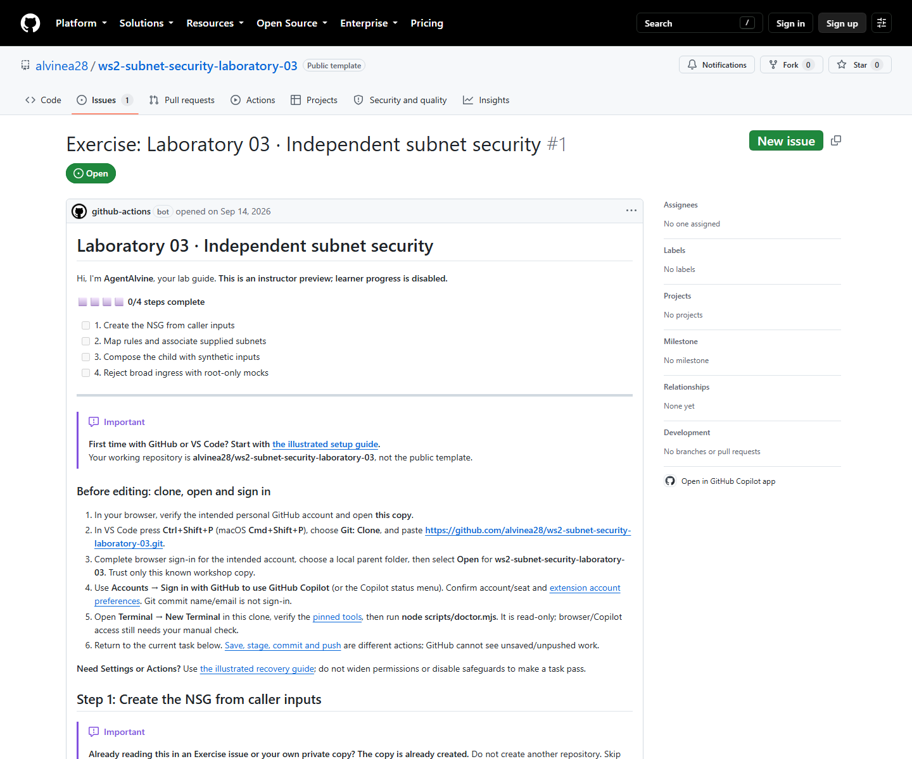

# Laboratory 03 — Full workshop review

> Review copy; follow your private copy’s live Exercise issue to do the lab.

[Full first-time setup](00-start-here.md) · [Original simulation summary and verification limits](simulation.md) · [Repository landing page](../README.md)

This review contains all four complete lessons from [.github/agentalvine/course.json](../.github/agentalvine/course.json), including setup, commands, expected results, recovery, and attributed reference images. Only relative Markdown links outside code fences are rebased in the copied lessons. The recorded statuses belong to the **2026-09-08 private participant simulations**, not to a reader or the public template.

| Activity | Full lesson | Cycle A | Cycle B |
| --- | --- | --- | --- |
| 01 | [Create the NSG from caller inputs](activity-01.md) | Recorded verified | Recorded verified |
| 02 | [Map rules and associate supplied subnets](activity-02.md) | Recorded verified | Recorded verified |
| 03 | [Compose the child with synthetic inputs](activity-03.md) | Recorded verified | Recorded verified |
| 04 | [Reject broad ingress with root-only mocks](activity-04.md) | Recorded verified | Recorded verified |

Both original cycles reached **4/4 offline completion**. Whole-lab suite counts are not per-activity tests, and completion is not a deployed security policy or human approval.

## The Exercise issue is the learner guide

1. **Copy once:** create your own private numbered laboratory copy using the [repository landing page](../README.md), then clone and open that copy using the [full setup](00-start-here.md).
2. **Open one Exercise issue:** after copying, use **your copy's README Exercise link**, not the public source link below. Its current **issue body** contains the task, files, acceptance criteria, progress, and next action. It is a learner guide, not a bug ticket or evidence submission.
3. **Do the actual task:** edit → save → review the diff → stage → commit → push when files must change. Perform a real PR/review/merge or other GitHub activity only where a lesson actually requires it; Lab 03 has no additional PR or review gate.
4. **Let credential-free checks observe the work:** the standalone learner-root checks validate the relevant revision with provider mocks and synthetic subnet IDs, without Azure credentials, OIDC, or state access.
5. **Return to the SAME ISSUE BODY:** AgentAlvine updates that body automatically, then presents the next task. **AgentAlvine is implemented with GitHub Actions**; the Actions tab is for run diagnostics, not a replacement for the Exercise issue.

Manual checkboxes, comments claiming success, and screenshots do not award progress. GitHub issue progression never authorizes Azure. The [workshop catalogue](https://github.com/alvinea28/ws2-workshop-catalogue) is a navigation repository and has **no course Exercise issue**.

## Public source preview — read only, not your learner issue

[Open the live source Exercise #1 instructor Preview](https://github.com/alvinea28/ws2-subnet-security-laboratory-03/issues/1).

The **2026-09-14 read-only GitHub observation** confirmed a successful source Preview run and an explicitly **read-only instructor Preview at step 0, with 0/4 participant progress**. This is not either private Cycle A/B issue, not a completed simulation, and not your own learner issue. After copying, use the Exercise link maintained in **your copy's README**.

*Captured on 2026-09-14 from the actual public GitHub Exercise #1: read-only instructor Preview, step 0 (0/4). [images/provenance.json](images/provenance.json) records the PNG SHA-256 and exact capture timestamp. This current source Preview is not a September 8 participant screenshot or either private 4/4 outcome.*

See the separate [fresh local verification results](simulation.md#fresh-2026-09-14-verified-results) for command-output evidence, not participant progress.

## If your private copy's Exercise is missing

First refresh your copy's README and **Issues**, then inspect **Actions → AgentAlvine** and follow [missing-Exercise recovery](../docs/troubleshooting.md#agentalvine-or-the-exercise-is-missing). A busy queue can take longer than the initial wait.

**Recovery only:** in the actual private learner copy, choose **Actions → AgentAlvine → Run workflow → Check progress**, selecting that copy's **actual default branch** (normally `dev`). This is not the normal progression protocol. **Do not choose Preview in a learner copy.** Do not create a fake Exercise, widen workflow/token permissions, disable protections, or dispatch a delivery workflow. Ask the instructor about a blocked policy rather than bypassing it.
