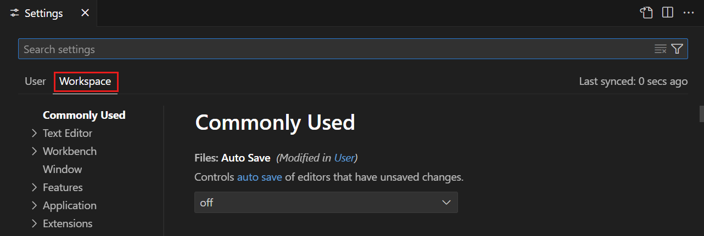

# Activity 02 — Map rules and associate supplied subnets

[Review index](README.md) · [Full setup](00-start-here.md) · [Previous activity](activity-01.md) · [Next activity](activity-03.md) · [Simulation record](simulation.md)

> Review copy; follow your private copy’s live Exercise issue to do the lab.

<!-- FULL-WS-LESSON:START -->
## Laboratory 03 - Step 2/4

### Map every rule field and associate each supplied subnet

| Before you begin | This step |
| --- | --- |
| Goal | Complete the standalone security root with stable rule/association maps and resource-backed outputs. |
| Time | 15–20 minutes. |
| Files | Edit [main.tf](../main.tf) and [outputs.tf](../outputs.tf); leave [variables.tf](../variables.tf) unchanged. |
| Starting branch | `lab/security` in this independent private Laboratory 03 copy. |

Beginner guides: [Start here](../docs/start-here.md) · [Git workflow](../docs/git-workflow.md) · [Copilot guide](../docs/copilot-guide.md) · [Toolchain](../docs/toolchain.md) · [Troubleshooting](../docs/troubleshooting.md).

> [!NOTE]
> The NSG already exists in your authored root from Step 1. Add to it; do not import another lab's implementation.
> Node **24.16.0**, Terraform **1.16.1**, and AzureRM **5.4.0** remain pinned. All execution in this lab is provider-mocked.

### 1. Append complete standalone rule and association resources

1. Confirm this clone and `lab/security` in VS Code; press **Ctrl+P** → [main.tf](../main.tf).
2. Keep `azurerm_network_security_group.this` intact. After that resource's closing brace, append both complete blocks below.
3. Do not place either block inside the NSG; these are separate, top-level resources.

```hcl
resource "azurerm_network_security_rule" "this" {
  for_each = var.rules

  name                        = each.key
  resource_group_name         = var.resource_group_name
  network_security_group_name = azurerm_network_security_group.this.name
  priority                    = each.value.priority
  direction                   = each.value.direction
  access                      = each.value.access
  protocol                    = each.value.protocol
  source_port_range           = each.value.source_port_range
  destination_port_range      = each.value.destination_port_range
  source_address_prefix       = each.value.source_address_prefix
  destination_address_prefix  = each.value.destination_address_prefix
  description                 = each.value.description
}

resource "azurerm_subnet_network_security_group_association" "this" {
  for_each = var.subnet_ids

  subnet_id                 = each.value
  network_security_group_id = azurerm_network_security_group.this.id

  depends_on = [azurerm_network_security_rule.this]
}
```

4. Check all nine rule fields against the supplied object type; preserve both address prefixes and the two-space HCL formatting shown.
5. Press **Ctrl+S** after completing both blocks. Remove remaining unfinished comments from this implementation.
6. Keep `source_port_range` and `description` wired even when callers omit them; the supplied type supplies their defaults.

### 2. Finish the public outputs

1. Press **Ctrl+P** → [outputs.tf](../outputs.tf).
2. Preserve `nsg_id` and replace the unfinished association output; the complete resulting file should contain these two outputs:

```hcl
output "nsg_id" {
  description = "Azure resource ID of the managed network security group."
  value       = azurerm_network_security_group.this.id
}

output "association_ids" {
  description = "NSG association IDs keyed by the caller's stable subnet names."
  value       = tomap({ for name, association in azurerm_subnet_network_security_group_association.this : name => association.id })
}
```

3. Remove all unfinished markers from both edited files and press **Ctrl+S**.
4. Return actual resource expressions, not supplied IDs copied straight into an output to bypass the association resource.

### 3. Check the meaning of both maps and their dependency

| Contract detail | Review question |
| --- | --- |
| `for_each = var.rules` | Is each standalone rule keyed by the caller's rule name, with `name = each.key`? |
| Nine rule fields | Are priority, direction, access, protocol, both ports, both prefixes, and description all forwarded unchanged? |
| NSG name versus ID | Does the rule use the NSG **name**, while the association uses the NSG **ID**? |
| `for_each = var.subnet_ids` | Does each association receive that key's supplied subnet ID through `each.value`? |
| `depends_on` | Do associations explicitly wait for all custom rule resources as well as the NSG? |
| `association_ids` | Does the output retain caller keys and read each association's resource ID? |

An empty rule map means no custom rule instances; it does not remove Azure's default NSG rules.
Stable keys preserve association identity when a caller adds another subnet; list indexes would make the contract positional.
Do not mix inline NSG rules with standalone rule resources, add tags to rules/associations, or look up supplied subnets.

> [!WARNING]
> Preserve the existing RFC1918-only inbound-Allow guard, priority/port checks, types, and provider locks.
> Do not add VMs, VNets, subnets, resource groups, a root provider/backend, Azure login, state access, or real plan/apply.
> The explicit dependency orders resources; it does not certify a live firewall policy or authorize deployment.

### 4. Inspect formatting without resetting the editor

1. Select **Terminal** → **New Terminal**, confirm the root, and check the two edited files:

```powershell
terraform fmt -check main.tf outputs.tf
```

2. If a file is listed, reopen it through **Ctrl+P**, correct indentation/alignment, **Ctrl+S**, and rerun the check.
3. For an editor spacing problem, press **Ctrl+,** → **Workspace** and inspect **Editor: Tab Size** and **Editor: Insert Spaces** for HCL.
4. Do not reset **User** settings, accept an unrelated formatter change, or reformat every file to hide one mismatch.


*REFERENCE — Microsoft publisher screenshot, CC BY 3.0 US. Its example settings state is not your clone's configuration; [attribution](../docs/images/NOTICE.md).*

### 5. Review, stage, commit, push, and inspect the actual run

1. Press **Ctrl+Shift+G** for **Source Control** and open both diffs; check that the NSG remains and no validation was altered.
2. Select each file's **+** (**Stage Changes**), inspect **Staged Changes**, and enter `lab: wire security rules and subnet associations` in **Message**.
3. Select **Commit**, then **...** → **Push**; use **Publish Branch** only if the branch was never published to your copy.
4. Refresh **your own private repository**, select `lab/security` in **Code**, and inspect the newest commit's two files.
5. Open **Actions** → **Lab checks** → that newest-commit run → **Test learner module** → the learner-check command log.
6. Read the first actual error or test summary. Example formatting or incomplete later gates may remain; a green job alone does not complete the later authored test task.
7. Refresh the Exercise **body** after **AgentAlvine** finishes; read its specific next task rather than editing progress manually.

### Expected result and what AgentAlvine checks

- The root has both required resource types, `for_each` over `var.rules` and `var.subnet_ids`, both prefix mappings, and the NSG ID reference.
- The output file contains the resource-backed association map and no unfinished text; the NSG output remains intact.
- The final CI gate exercises all field wiring and rejection cases against this root, not a reference module.

### Troubleshooting

| Symptom | Specific recovery |
| --- | --- |
| A rule argument is missing | Recheck the complete block above, especially source port and description; preserve defaults in the supplied variable type. |
| Rule uses an ID where a name is required | Use `azurerm_network_security_group.this.name` for the rule's NSG name argument. |
| Associations disappear or outputs are empty | Check `for_each = var.subnet_ids`, `each.value`, and the output comprehension over the association resources. |
| Forbidden resource/lookup appears | Remove only the unintended addition after reviewing the diff; callers provide those dependencies. |

**Next action:** open [Step 3: compose this child using synthetic IDs](activity-03.md).
<!-- FULL-WS-LESSON:END -->

## Recorded simulation outcome

**2026-09-08 — Cycle A: recorded verified; Cycle B: recorded verified.** Both private simulations recorded the rule-field mapping, supplied-subnet associations, and resource-backed association-output gate. Mocked wiring is not live firewall or connectivity evidence.

Whole-lab Node and mocked-case totals are not per-activity test counts. See the [simulation record and coverage limits](simulation.md).
