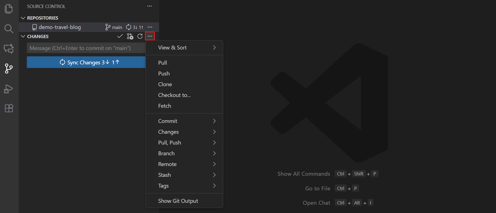

# Activity 03 — Compose the child with synthetic inputs

[Review index](README.md) · [Full setup](00-start-here.md) · [Previous activity](activity-02.md) · [Next activity](activity-04.md) · [Simulation record](simulation.md)

> Review copy; follow your private copy’s live Exercise issue to do the lab.

<!-- FULL-WS-LESSON:START -->
## Laboratory 03 - Step 3/4

**Goal:** Show how a caller supplies subnet IDs without creating or discovering infrastructure.

**Work:** your private copy's root, branch `lab/security`.
**File:** edit only [examples/basic/main.tf](../examples/basic/main.tf).

[Setup](../docs/start-here.md) · [Git help](../docs/git-workflow.md) · [Toolchain](../docs/toolchain.md) · [Recovery](../docs/troubleshooting.md)

### Do 1 — Complete the local caller

Open the example with **Ctrl+P**. Replace its unfinished source/comment; keep every caller field and the example-only provider. The complete result is:

```hcl
# Mock-only composition example; never plan or apply this caller against Azure.
module "security" {
  source = "../.."

  name                = "ws2-security"
  resource_group_name = "rg-ws2-existing"
  location            = "southeastasia"
  subnet_ids = {
    web  = "/subscriptions/00000000-0000-0000-0000-000000000000/resourceGroups/rg-ws2-existing/providers/Microsoft.Network/virtualNetworks/ws2-network/subnets/web"
    data = "/subscriptions/00000000-0000-0000-0000-000000000000/resourceGroups/rg-ws2-existing/providers/Microsoft.Network/virtualNetworks/ws2-network/subnets/data"
  }
  tags = {
    owner       = "team"
    environment = "dev"
    cost_center = "training"
    workshop    = "ws2"
  }
  rules = {}
}

provider "azurerm" {
  features {}
  resource_provider_registrations = "none"
}
```

### Do 2 — Check the ownership boundary

- `source = "../.."` reaches this security root from the example; no other lab is required.
- The full IDs and all-zero UUID are **synthetic fixtures, not real Azure resources or credentials**. Keep both `/subnets/web` and `/subnets/data`; a VNet ID alone is invalid.
- Caller keys stay stable; all four tags remain nonblank. `rules = {}` keeps Azure's built-in rules, not zero trust.
- A configured provider is **not a mock**. Keep it only in the example; provider-mocked tests run at the repository root, not here.

Do not replace synthetic values with real IDs or add lookups, infrastructure, credentials or a backend. No Azure login, backend/state access or real plan/apply; never initialize or execute this illustrative caller.

### Do 3 — Check formatting

Save, then open **Terminal → New Terminal** at the repository root. Keep Node **24.16.0**, Terraform **1.16.1**, and AzureRM **5.4.0**:

```powershell
terraform fmt -check 'examples/basic/main.tf'
```
**Why:** `fmt -check` inspects only the example's formatting without running its provider. **Expected:** exit 0, no listed file. If listed, fix two-space indentation/alignment in VS Code, save and rerun; do not change validation or pins.

### Do 4 — Save and advance

**Save → stage → commit → push → refresh the SAME Exercise.** Review the one-file diff and use `lab: demonstrate injected subnet IDs`; see [Git help](../docs/git-workflow.md).

Inspect **Actions → Lab checks → newest commit → Test learner module**. AgentAlvine checks the local source, two complete IDs, tags and rules, with no `TODO` or `REPLACE_ME`. This is a composition-content gate, not deployment proof; the authored rejection remains next.


*REFERENCE — Microsoft, CC BY 3.0 US; example branch/repository, not your push. [Attribution](../docs/images/NOTICE.md).*

If pending, check the saved/pushed branch and local source. If anything asks for Azure credentials, stop: you are not on the approved root-mock route.

**Next:** [Step 4 — wildcard rejection](activity-04.md).
<!-- FULL-WS-LESSON:END -->

## Recorded simulation outcome

**2026-09-08 — Cycle A: recorded verified; Cycle B: recorded verified.** Both private simulations recorded the example caller pointing at the local security root with complete synthetic web/data subnet IDs, tags, and rules input. The example was not provisioned against Azure.

Whole-lab Node and mocked-case totals are not per-activity test counts. See the [simulation record and coverage limits](simulation.md).
