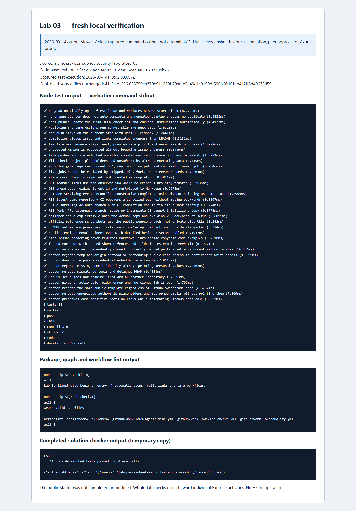

# Laboratory 03 — Recorded simulations and review evidence

[Review index](README.md) · [Full setup](00-start-here.md) · [First activity](activity-01.md)

## Original participant cycles — 2026-09-08

These are the preserved **Revision 4 Cycle A and Cycle B** results, not fresh tests and not the public source Preview. The [original public maintenance summary](../docs/daily%20work%20report/2026-09-08.md) reports the same whole-lab counts.

| Original cycle | Exercise progress | Whole-lab Node tests passed | Mocked cases/fixtures passed | Scope |
| --- | --- | --- | --- | --- |
| A | 4/4 | 32 | 42 | Offline standalone security root complete |
| B | 4/4 | 35 | 42 | Offline standalone security root complete |

### Per-activity outcomes

| Activity | What the preserved progress records establish | Cycle A | Cycle B |
| --- | --- | --- | --- |
| [01 — Caller-owned NSG inputs](activity-01.md) | The learner NSG consumed caller inputs and exposed its resource-backed `nsg_id`, without creating shared infrastructure. | Recorded verified | Recorded verified |
| [02 — Rules and associations](activity-02.md) | The learner mapped rule fields, associated supplied subnet IDs by stable keys, and returned association resource IDs. | Recorded verified | Recorded verified |
| [03 — Synthetic caller](activity-03.md) | The local-source example supplied complete all-zero-UUID web/data subnet IDs, ownership tags, and rules without lookups. | Recorded verified | Recorded verified |
| [04 — Intended ingress rejection](activity-04.md) | The learner-added wildcard rejection targeted `var.rules`; the actual learner-root suite and **Test learner module** gate satisfied 4/4 offline completion. | Recorded verified | Recorded verified |

The cycles exercised private learner copies, pushed implementation/example/test changes, and actual GitHub progression. Terraform **1.16.1** with the supplied AzureRM **5.4.0** lock validated the authored security root with mocks, not a different lab or a deployed subnet. Backend-disabled/read-only-lock initialization may download the pinned provider; it does not access Azure or remote state.

### Rejection coverage appropriate to this root

The [supplied security tests](../tests/security.tftest.hcl) cover the stable web/data association interface and a valid narrow inbound rule. Their real negative cases reject empty/malformed subnet IDs, a VNet ID substituted for a subnet ID, unstable subnet keys, missing/blank/null tag values, a blank resource group or location, and an invalid name at the corresponding input validations.

The [fourth activity](activity-04.md) adds `reject_wildcard_ingress` to that same learner test file. It must pass through `expect_failures = [var.rules]`: the forbidden value is an inbound-Allow **source address** of `*`, not the allowed source-port default. This independent root uses `rules`, not the composed baseline's `security_rules`. The full suite also retains the supplied rule and wiring cases; **42 is the recorded whole-root mocked total in each cycle**, not a count assigned separately to each activity. A missing expected failure, skipped/zero tests, or an unrelated provider error is not a valid rejection result.

**32/35 are whole-lab Node totals, not per-activity tests.** Across **all eight laboratories**, each original cycle recorded **25/33 activities**; Cycle A recorded **301 Node tests**, Cycle B **325 Node tests**, and **each cycle recorded 229 mocked cases/fixtures**. Those all-lab totals already include this lab. Do not add repeated helper/CI runs, focused-test reruns, per-activity rows, or later verification to them, and do not combine Node tests with Terraform cases as one coverage count.

## Original proof stays private

Authorized reviewers can open the [original Lab 03 private review and immutable evidence links](https://github.com/alvine-aurelio-org/ws2-public-rebuild-20260908-evidence/blob/dev/full-ws-content/lab-03/README.md). **Organization access is required.** The detailed originals, preserved immutable records, and private CI links remain there; this public summary does not reproduce raw participant logs or private CI commit identifiers.

No historical per-activity screenshots existed. The private activity images were captured on **2026-09-14** from a labelled local viewer of the preserved original A/B records, not September 8 GitHub UI. Screenshots support interpretation; the original immutable records and linked CI evidence in the private review are the proof.

## Separate verification and screenshots — 2026-09-14

- **Source Exercise:** the read-only GitHub observation confirmed the [live public Exercise #1](https://github.com/alvinea28/ws2-subnet-security-laboratory-03/issues/1) as an instructor Preview after a successful real run, at **step 0 with 0/4 participant progress**. Its actual GitHub screenshot is on the [review index](README.md#public-source-preview--read-only-not-your-learner-issue), with PNG digest and capture timestamp in [images/provenance.json](images/provenance.json); it is not either private simulation issue.
- **Fresh local validation:** source-quality checks and the real completed-solution fixture checker passed, with the solution exercised in an isolated **temporary copy**. The pinned workshop toolchain was Terraform **1.16.1**, AzureRM **5.4.0**, and terraform-docs **0.24.0** for documentation checks. No Azure operations occurred.

### Fresh 2026-09-14 verified results

| Check | Result |
| --- | --- |
| Node tests | 35 passed; 0 failed; 0 skipped |
| auto-kit | Passed |
| graph | Passed |
| actionlint | Passed |
| Completed-solution checker | Passed — isolated temporary copy |

These are fresh whole-lab checks, not per-activity proof or new mock totals. The [fresh command record (organization access required)](https://github.com/alvine-aurelio-org/ws2-public-rebuild-20260908-evidence/blob/dev/evidence/review-2026-09-14/local/lab-03.json) is separate from the original A/B records; their progress and counts are unchanged.

*Captured on 2026-09-14 from a labelled local output viewer of the actual fresh commands, including the completed-solution fixture check in a temporary copy. This is not terminal UI, historical GitHub UI, a third participant cycle, or human/live approval. [images/provenance.json](images/provenance.json) records the PNG SHA-256 and exact capture timestamp.*

## What remains outside the evidence

No Azure deployments, identity creation, state access, or subscription operations were performed in these offline simulations or this documentation pass. No live policy, reachability, least-privilege/zero-trust posture, egress safety, cloud health, GUI onboarding, MFA flow, Copilot seat, or human approval is proved. Empty custom rules retain Azure's built-in NSG rules. No functional offline blocker remained recorded for this lab, but mock success and an Exercise checkbox never authorize Azure.
